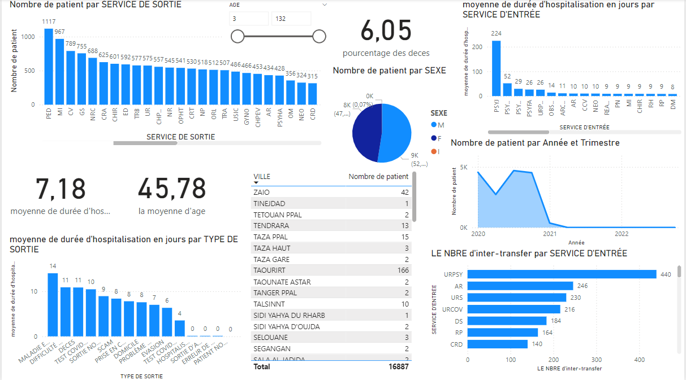
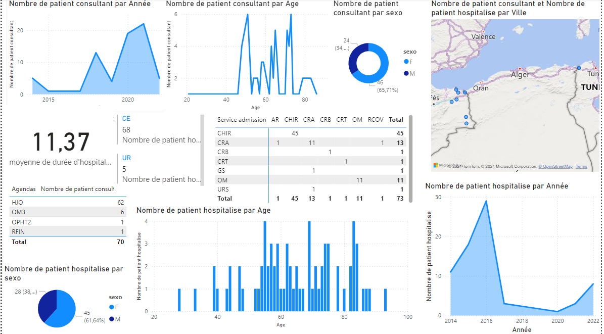
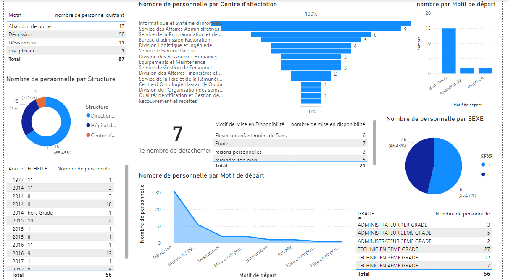

# 🏥 Hospital Data Analysis Using Power BI

This project focuses on the analysis of hospital data collected during the COVID-19 pandemic in Morocco. Using **Power BI**, the goal was to explore and visualize key insights from the hospital activity, patient admissions, hospitalizations, consultations, and the management of human resources.

## 📋 Project Overview

The analysis is based on three key datasets:
1. **Hospital Activity**: Covers admissions, discharges, and patient transfers.
2. **Hospitalization and Consultation**: Provides insights into diagnoses, treatments, and patient stay durations.
3. **Human Resources**: Analyzes the management of hospital staff, including personnel departures, job grades, and availability status.

The project aims to identify important trends, including the impact of COVID-19 on hospital operations, resource allocation, and patient outcomes.

## 🛠️ Key Features

- **Data Analysis**: 
  - Patient admissions and discharges
  - COVID-19 impact on hospital services
  - Mortality and patient demographics
  - Resource allocation (human resources, beds, etc.)
  
- **Dashboards**: 
  - Visualizations of key trends, geographical patient distribution, and resource usage.

## 🚀 Technologies Used

- **Tools**: Power BI, Microsoft Excel (for data pre-processing)
- **Data Sources**: Hospital data from Moroccan health institutions during COVID-19.
  

## 📊 Dashboards and Visualizations

1. **Patient Admissions by Gender**  
   

2. **Geographical Distribution of Patients**  
   

3. **Average Hospitalization Duration by Service**  
   

## ⚙️ How It Works

1. **Data Cleaning and Preparation**:
   - The datasets were cleaned to remove inconsistencies and standardize data types.
   
2. **Power BI Visualizations**:
   - Dashboards were created to analyze hospital activity, patient admissions, and human resources.
   - Custom measures and DAX functions were used to calculate key statistics such as average hospitalization duration and mortality rate.

3. **Analysis**:
   - Key trends were identified, such as a decrease in patient admissions toward the end of 2021 and a high mortality rate for patients aged 0-2 and over 50.

## 📝 Key Insights

- **Patient Demographics**: Most patients admitted during the study period were male, with a notable mortality rate for infants and elderly patients.
- **COVID-19 Impact**: A sharp decline in patient admissions was observed at the end of 2021, coinciding with the peak of the pandemic.
- **Human Resources**: High personnel turnover, particularly in 2023, highlights the strain on hospital staff during and after the pandemic.

## 📚 Future Improvements

- **Data Expansion**: Incorporate additional datasets from other hospitals or health regions for more comprehensive analysis.
- **Predictive Modeling**: Apply machine learning to predict future trends in hospital admissions and resource needs.
- **Optimization**: Refine visualizations with more detailed filtering and segmentation options.

---

